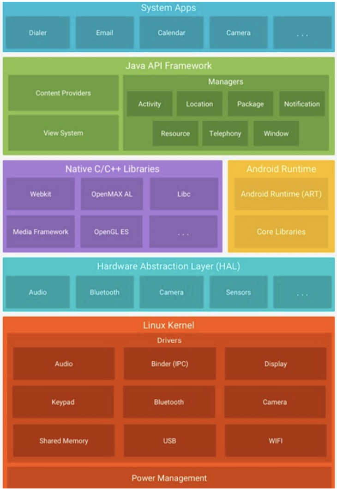
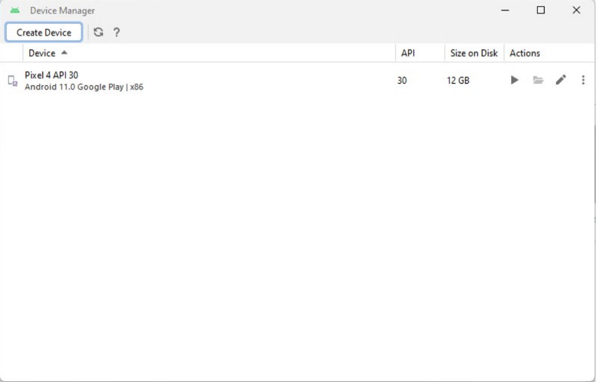

# Curs 1 - 2

## Arhitectura hardware a dispozitivelor mobile 

1. System on Chip (SoC):

- Procesor comunicatii
- Procesor animatii
- GPU

2. Memorie
- RAM
- Flash

3. Sursa de alimentare

4. SIM

5. Ecran 

6. Senzori

## Sisteme de operare

- Gestioneaza resursele hardware si software ale dispozitivului
- Gestioneaza memoria, procesele, dipozitivile I/O, API-uri
- Managementul fisierelor
- Interfata cu utilizatorul

```
Aplicatii
    |
    |
    |
    |
Interfata cu utilizatorul
    |
    |
    |
    |
Interfata cu programele
    |
    |
    |
    |
Servicii / Biblioteci / Telefonie
    |
    |
    |
    |
Kernel
    |
    |
    |
    |
Drivere
    |
    |
    |
    |
Hardware
```

Exemple:

1. Android - Google
2. IOS/IpadOS - Apple
3. Windows 10 Mobile / Phone / CE / Mobile - Microsoft
4. Tizen
5. Linux Mobile

etc.

## Aplicatii mobile

Pot sa fie de 3 feluri:

1. Native
2. Hibride
- Cod binar interpretabil sau compilat JIT
- Utilizeaza un nivel intermediar
3. Aplicatii web optimizate pentru dispozitive mobile

## Android

- Proiectat de Google in 2007
- Nucleu Linix 4.x/5.x
- Aplicatii bazate pe Java sau Kotlin

### Modelul de programare

- Nicleu Linux - Biblioteci native C
- Limbaje de programare - Java, Kotlin sau C/Cpp pentru interfata de programare natica
- Masina virtuala proprie - **Android Runtime (ART)**



### Mediul de executie

- Este Android Runtime (ART) 
- Compilare AOT (inainte de executie)
- Compativil cu masina virtuala Dalvik - compilare JIT
- Fiecare aplicatie este rulata intr-un proces separat

PS: **Compilare JIT** inseamna ca cele mai utilizate parti de cod (hot spots) sunt transformare din bytecode in cod nativ. Acest cod este stocat in memorie si utilizat mereu pentru a nu se mai reinterpreta

### Android SDK

- Biblioteci si resurse specifice fiecarei platforme Android
- Instrumente pentru compilarea si generarea continutului binar executabil

**Instrumentele**

1. aapt2 - compilare, indexare in format binar
2. apksigner - semnare digitala pachet aplicatie
3. dx/d8 - conversie cod binar Java la cod binar Dalvik
4. zipalign - optimizare pachet aplicatie (APK)
5. logcat - acces la mesajele din fisier (logs)
6. sqlite3 - SGBD SQLite
7. sdkmanager - gestionare componente/versiuni Android
8. emulator - lansare emulator
9. avdmanager - gestionare dispozitivie virtuale
10. aehd/haxm - drivere
11. adb - comunicare cu dispozitivele Android

### Android Virtual Device (AVD) Manager

- AVD este emulatorul care simuleaza un dispozitiv Android pe calculator



### Android Debug Bridge (ADB)

- Asigura comunicarea intre masina de dezvoltare si dispozitivele Android (reale sau virtuale)

**Componente**:

1. Client 
- Permite transmiterea de comenzi

2. Server
- Masina de dezvoltare
- Dispozitivul Android

## Componente de baza ale aplicatiilor Android

1. Activitati (<i>android.app.Activity</i>)
2. Servicii (<i>android.app.Service</i>)
3. Furnizori de continut (<i>android.content.ContentProvider</i>)
4. Receptori de mesaje (<i>android.content.BroadcastReceiver</i>)
- mesajele fac parte din Intent

### Activitatile

- Asociate ferestrelor aplicatiei
- Orice aplicatie are o activitate principala
- O activitate are componente vizuale asociate (View)
- Se pot modulariza prin intermediul fragmentelor

### Servicii

- Componente ale aplicatiilor Android
- Nu au interfata grafica
- Ruleaza in acelasi proces cu aplicatia gazda, in firul principal
- Permit derularea activitatilor in fundal
- **Utilizatorul poate muta catre alte aplicatii, dar serviciul va rula in continuare**

### Furnizori de continut

- Ofera suport pentru partajarea datelor intre aplicatii
- Datele partajate sunt stocare in diferite surse

### Mesajele

- Sunt obiecte de tipul intent
- Pentru activari se utilizeaza compontele de tip asincron (incapsulate in obiecte de tip Intent)
- Ajuta la invocarea componentelor si la comunicarea intre componente

### Receptionarea mesajelor

- Aplicatiile reactioneaza la aparitia unor evenimente (apel telefonic, nivelul bateriei scaduz, primirea unui mesaj)
- Nu au interfata grafica
- O aplicatie poate include mai multe componente pentru receptionarea de evenimente

## Structura unui proiect Android

1. app - radacina modulului
2. AndroidManifest.xml - fisierul de descriere a aplicatiei
3. src - Fisierul sursa
4. build - Fisiere binare
5. libs - Biblioteci
6. build.gradle - Proprietatile sistemului de compilare la nivel de modul (build.gradle.kts este la nivel de proiect)
7. settings.gradle - parametrii proiectului

## Gradle 

- Un set de instrumente pentru automatizarea procesului de crearea de fisiere binare ale aplicatiei
- **Android Gradle Plugin (AGP)**

## Fisierele binare Android

.java -> .class -> .dex + resurse -> .apk