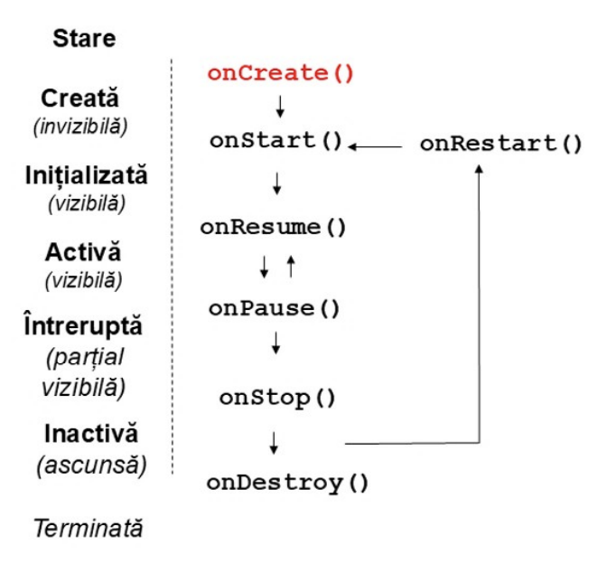

# Contextul si Clasa Aplicatiei

## Contextul

- Asigura accesul la mediul aplicatiei / componentei
- Ajuta la crearea de componente vizuale, accesul al resurse, lansarea de activitati noi, permisiuni, etc.
- Provine din clasa abstracta Context (android.content)

```
                            Context
                               |
                               |
                         Context Wrapper
                               |
                               |
                               |
                ---------------------------------
                |              |                |
            Application     Service       ContextThemeWrapper
                                                |
                                             Activity
```

## Aplicatia

- Lansata de executie de utilizator
- Are un ciclu de viata propriu
- Sistemul poate incheia executia aplicatiei
- Este derivata din Application
- Generata implic (referinta prin metoda getApplication())
- Are un context asociat

### Accesul la context 

- <i>getApplicationContext()</i>
- Se aplica la nivelul activitatii / serviciului pe this
- Fiecare obiect grafic refera contextul activitatii asociate (getContext())

## Activitatile

- Sunt asociate ecranelor aplicatiei
- Derivate din android.app.Activity
- Activitatile sunt stocate intr-o stiva de activitati

&emsp; **Cum funcționează stiva de activități în Android?**

1. *Adăugarea unei activități:*

&emsp;&emsp; • Când o activitate nouă este pornită (ex. startActivity()), aceasta este adăugată în vârful stivei.

&emsp;&emsp; • Activitatea curentă (cea de sub ea) este pusă în starea onPause, iar activitatea nouă devine activă.

2. *Eliminarea unei activități:*

&emsp;&emsp; • Când o activitate este închisă (de exemplu, utilizatorul apasă butonul Back sau se finalizează programatic cu finish()), activitatea de pe vârful stivei este eliminată.

&emsp;&emsp; • Activitatea de sub ea (următoarea în stivă) este reluată (se apelează metoda onResume()).

- Au reprezentare grafica

- Au un ciclu de viata

1. onCreate -> aplicatia este creata pentru prima data
2. onStart -> aplicatia devine vizibila pentru utilizator
3. onResume -> cand activitatea redevine activa (spre exemplu Back din alta activitate) 
4. onPause -> activitatea intra in fundal
5. onStop -> aplicatia nu mai este vizibila utilizatorului
6. onDestroy 



- La rotirea ecranului aplicatia este onPause -> onStop -> onDestroy si apoi recreata onCreate -> onStart

- Activiatile sunt recrate pentru a corespunde noile cerinta (rotierea ecranului, activarea sau dezactivarea tastaturii fizice, schimbarea limbii)

## Clasa Bundle

- Permite stocarea si regasirea de valori dupa o cheie de tip String

- Se pot salva tipuri simple de date sau tipuri care implemeneteaza Parcelable sau Serializable

- Se utilizeaza *put[DataType]* si *get[DataType]* 

- Salvarea starii: onSaveInstanceState(Bundle stare) -> apelata la iesirea fortata din aplicatie (modifcare configuratie)

- Restaurarea starii: onRestoreInstanceState(Bundle stare) sau onCreate(Bundle Stare)

- onRestoreInstanceState() vine inainte de onResume

- onSaveInstanceState() vine inainte de onStop()

- Lansarea unei activitati se face printr-un filtru de mesaje

### Intent

- Obiectul de tip Intent are un context asociat + o clasa asociata (Context + Class<?>)

```java
Intent intent = new Intent(this, AddActivity.class);
startActivity(intent)
```

## Terminarea activitatilor

- Utilizatorul poate incheia o activitate prin Back sau inchidere (Task)

- Asociata este functia *finish()*

- Sistemul poate inchide o aplicatie (kill)

## Proprietatile unei activitati

AndroidManifest.xml

```xml
<activity>
      android:name = ".MainActivity"
      android:label = "@string/app_name"
      android:exported = "true"
      <intent-filter>
            <action android:name = "android.intent.action.MAIN" />
            <category android:name = "android.intent.category.LAUNCHER" />
      </intent-filter>
</activity>
```

## Consola de mesaje (Logcat)

- Afiseaza mesaje transmise din aplicatii

- Provine din android.util.Log

- Foloseste un identificator surse mesaj (String) si mesajul propriu - zis

## Resursele

- Se stocheaza in directorul res

1. res/values -> string, color, masive, style
2. res/drawable -> imagini, grafica vectoriala
3. res/minimap -> pictograme
4. res/xml -> fisierele xml
5. res/raw -> fisierele de date
6. res/anim -> animatii

- Fiecare resursa este asociata unui identificator in clasa generata R

## Interfata grafica 

- Definita prin intermediul componentelor vizuale si a containerelor

- Widget = o componenta vizuala (controale)

- Containere = componente de aranjare, structurare (ViewGroup / Layout)

1. Clasa View 

- Utilizata pentru desenarea suprafetei si tratarea evenimentelor

- Bazata pe widgets

2. Clasa ViewGroup

- Derivata din View 

- Bazata pe containere 

## AndroidX

- Parte a Android Jetpack (colectie de biblioteci de clase)

- Asigura compatibilitatea pentru versiunile anterioare Android

## Identificarea componentelor

- Prin identificator (id): @+id/identificator SAU @id/identificator (pentru un id existent) SAU R.id.identificator (Java/Kotlin)

- Referire in Java code: findViewById() (se poate realiza dupa setContentView())

## Containere 

- Definesc structura vizuala a interfetei utilizatorului 

- Liniara (LinearLayout), Tabelara, Relativa

## Interfata in mod procedural

- Controale initializate in cod

- Constructori: Contextul curent

- *addView() + setContentView()*

**COMPARATIE MODURI DE CONSTRUIRE A INTERFETEI**

1. Interfața procedurală

```java
Button myButton = new Button(this);
myButton.setText("Click Me");
myButton.setLayoutParams(new LinearLayout.LayoutParams(
        LinearLayout.LayoutParams.WRAP_CONTENT,
        LinearLayout.LayoutParams.WRAP_CONTENT
));

LinearLayout layout = new LinearLayout(this);
layout.setOrientation(LinearLayout.VERTICAL);
layout.addView(myButton);

setContentView(layout);
```

2. Interfața declarativă

```xml
<LinearLayout
    xmlns:android="http://schemas.android.com/apk/res/android"
    android:layout_width="match_parent"
    android:layout_height="match_parent"
    android:orientation="vertical">

    <Button
        android:layout_width="wrap_content"
        android:layout_height="wrap_content"
        android:text="Click Me" />
</LinearLayout>
```

## Tratarea evenimentelor

1. De tip listener:

```java
View.onClickListener()
```

2. De tratarea evenimentelor:

```java
onClick()
```

3. Inregistrarea evenimentelor

```java
setOnClickListener()
```
