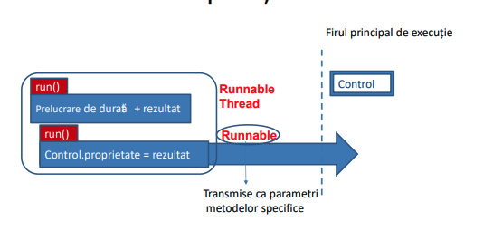

# Accesul la retea

- Necesita permisiune in AndroidManifest.xml:

```xml
<user-permission android.permisison.INTERNET>
```

- Prelucrarile au loc intr-un alt fir de executie

- Accesul prin HTTP se realizeaza prin HttpURLConnection

- Initializarea conexiunii se face prin openConnection()

- Descarcarea fisierelor se face prin DownloadManager - initiere cu enqueue()

## Servicii Web

- Ofera un standard de interoperare intre aplicatiile software care ruleaza pe o varietate de platforme si frameworkuri

- Clientul si serverul comunica prin HTTP prin intermediul WWW

# Operatii asincrone

- Activitati consumatoare de resurse (I/O, prelucrari complexe)

- Se realizeaza fara a bloca firul principal de executie

- **Problema:** actualizarea componentelor grafice din alt fir de executie decat cel in care au fost create

## Clasa Handler

- Transmitere de obiecte de tip Message si Runnable

- Receptionarea de tip Message

- Fiecare obiect de tip Handler este asociat unui fir de executie si a unei cozi de mesaje

- **handleMessage()**: Prelucrarea mesajelor

- **sendYYY()**: Transmiterea mesajelor

- Obiecte de tip Runnable (transmite catre coada de mesaje asociate firului de executie)

- Initializarea Handler - asociat unui fir de executie curent sau cu un Looper

## Operatii asincrone



- **Metode specifice:** runOnUiThread(Runnable)

- **View:** post(Runnable), postDelayed(Runnable, long)

# Prelucrarea fisierelor XML

1. SAX (Simple API for XML)
2. XML Pull
3. DOM

```java
SAXParserFactory fact = SAXParserFactory.newInstance();
SAXParser xmlParser = fact.newSAXParser();
XMLReader xmlReader = xmlParser.getXMLReader();
SAXHandler handler = new SAXHandler();
xmlReader.setContentHandler(handler);
xmlReader.parse(new InputSource(streamIn));
```

# DOM

1. Interfete

- Node

- Element

- NodeList

2. Clasa DocumentBuilder

- metoda **parse()** -> InputStream

3. Document

- **getElementByTagName()** -> NodeList

4. Element

- **getAttribute()**

5. Node

- **getTExtContent()**


